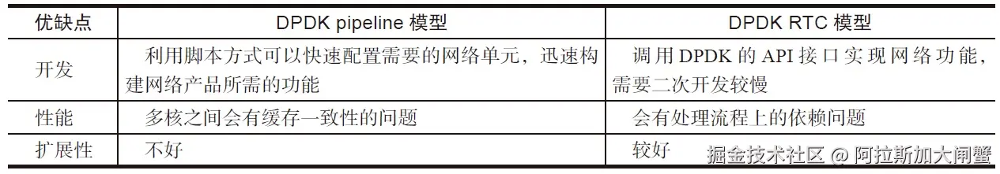
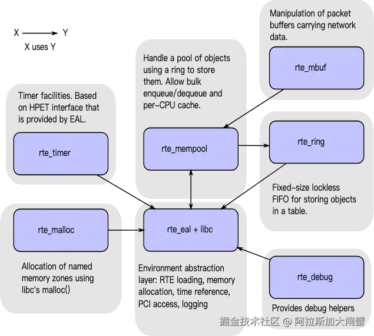
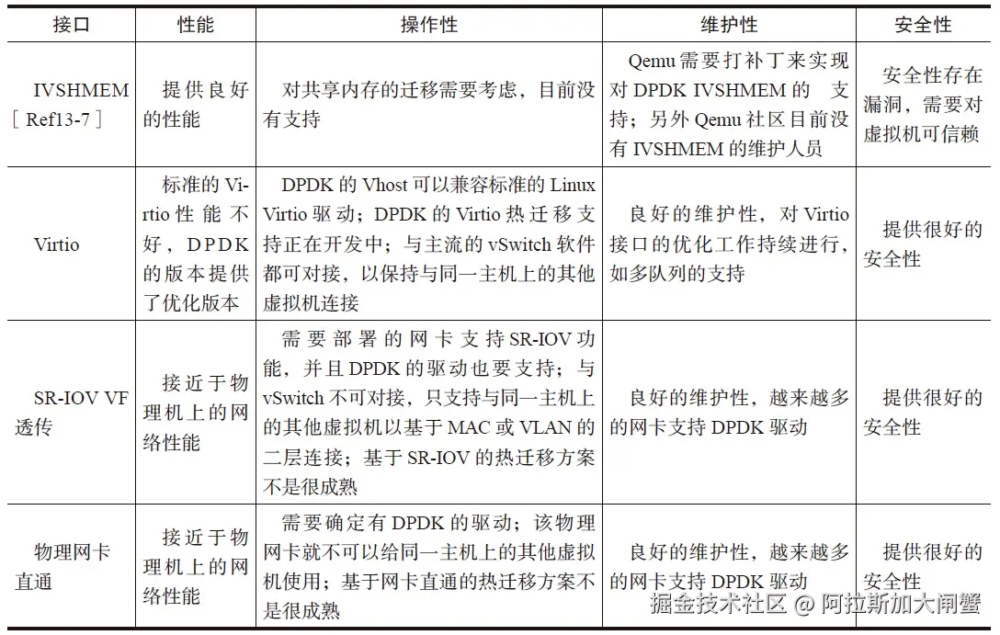
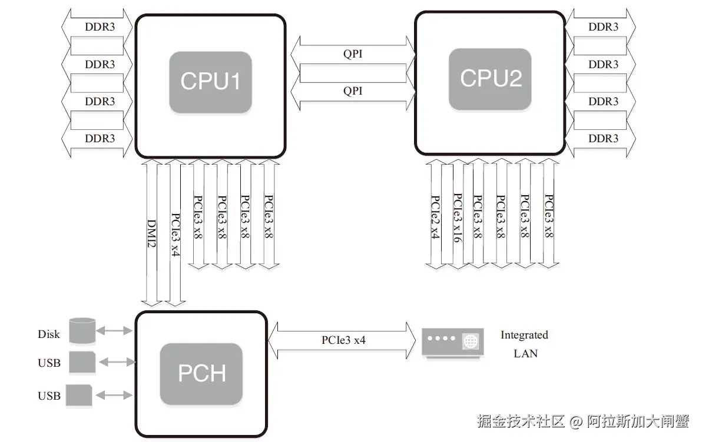
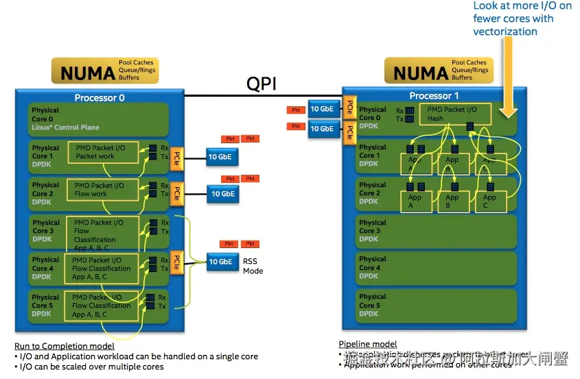
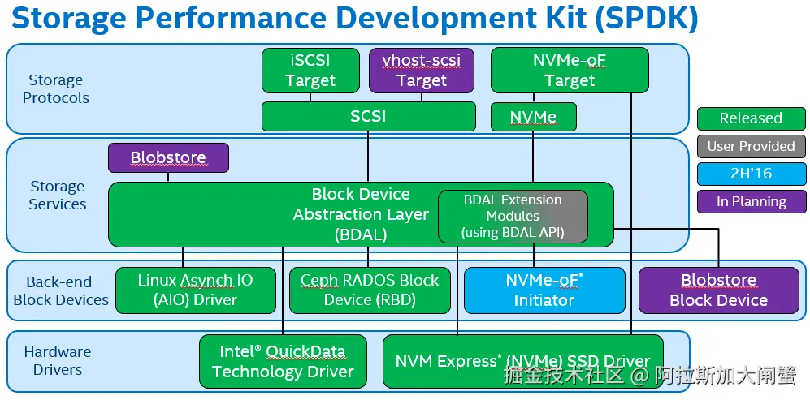
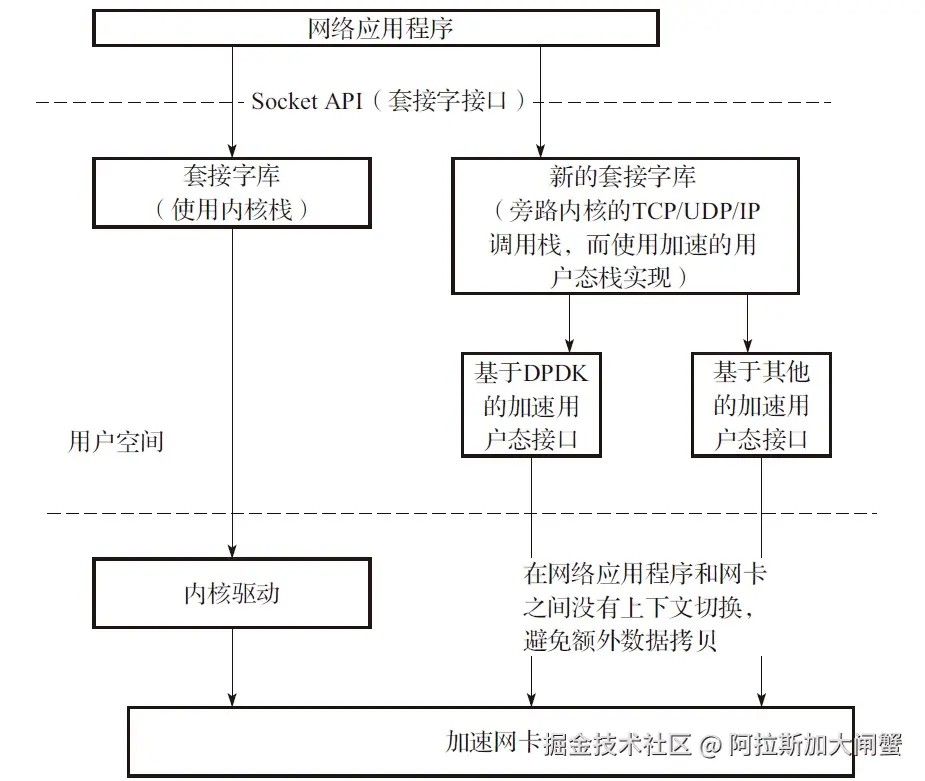

​

# DPDK简介

​

## dpdk架构

`Intel DPDK`全称`Intel Data Plane Development Kit`，是`intel`提供的数据平面开发工具集，为`Intel architecture（IA）`处理器架构下用户空间高效的数据包处理提供库函数和驱动的支持，它不同于`Linux`系统以通用性设计为目的，而是专注于网络应用中数据包的高性能处理。`DPDK`应用程序是运行在用户空间上利用自身提供的数据平面库来收发数据包，绕过了`Linux`内核协议栈对数据包处理过程。`Linux`内核将`DPDK`应用程序看作是一个普通的用户态进程，包括它的编译、连接和加载方式和普通程序没有什么两样。`DPDK`程序启动后只能有一个主线程，然后创建一些子线程并绑定到指定`CPU`核心上运行。

​

*   `EAL`（`Environment Abstraction Layer`）即环境抽象层，为应用提供了一个通用接口，隐藏了与底层库与设备打交道的相关细节。`EAL`实现了`DPDK`运行的初始化工作，基于大页表的内存分配，多核亲缘性设置，原子和锁操作，并将`PCI`设备地址映射到用户空间，方便应用程序访问。
*   `Buffer Manager API`通过预先从`EAL`上分配固定大小的多个内存对象，避免了在运行过程中动态进行内存分配和回收来提高效率，常常用作数据包`buffer`来使用。
*   `Queue Manager API`以高效的方式实现了无锁的`FIFO`环形队列，适合与一个生产者多个消费者、一个消费者多个生产者模型来避免等待，并且支持批量无锁的操作。
*   `Flow Classification API`通过`Intel SSE`基于多元组实现了高效的`hash`算法，以便快速的将数据包进行分类处理。该API一般用于路由查找过程中的最长前缀匹配中，安全产品中根据Flow五元组来标记不同用户的场景也可以使用。
*   `PMD`则实现了Intel`1GbE`、`10GbE`和`40GbE`网卡下基于轮询收发包的工作模式，大大加速网卡收发包性能。

## 传统Linux网络驱动的问题

*   中断开销突出，大量数据到来会触发频繁的中断（`softirq`）开销导致系统无法承受
*   需要把包从内核缓冲区拷贝到用户缓冲区，带来系统调用和数据包复制的开销
*   对于很多网络功能节点来说，`TCP/IP`协议并非是数据转发环节所必需的
*   `NAPI/Netmap`等虽然减少了内核到用户空间的数据拷贝，但操作系统调度带来的`cache`替换也会对性能产生负面影响

## 虚拟化

​

***

# NUMA简介

## NUMA

`NUMA`来源于`AMD Opteron`微架构，处理器和本地内存之间有更小的延迟和更大的带宽；每个处理器还可以有自己的总线。处理器访问本地的总线和内存时延迟低，而访问远程资源时则要高。

​

`DPDK`充分利用了`NUMA`的特点

*   `Per-core memory`，每个核都有自己的内存，一方面是本地内存的需要，另一方面也是为了cache一致性
*   用本地处理器和本地内存处理本地设备上产生的数据

CPU核心的几个概念：

*   处理器核数（`cpu cores`）：每个物理CPUcore的个数
*   逻辑处理器核心数（`siblings`）：单个物理处理器超线程的个数
*   系统物理处理器封装ID（`physical id`）：也称为socket插槽，物理机处理器封装个数，物理CPU个数
*   系统逻辑处理器ID（`processor`）：逻辑CPU数，是物理处理器的超线程技术

**CPU亲和性**

将进程与CPU绑定，提高了Cache命中率，从而减少内存访问损耗。CPU亲和性的主要应用场景为

*   大量计算场景
*   运行时间敏感、决定性的线程，即实时线程

相关工具

*   `sched_set_affinity()`、`sched_get_affinity()`内核函数
*   `taskset`命令
*   `isolcpus`内核启动参数：CPU绑定之后依然是有可能发生线程切换，可以借助`isolcpus=2,3`将cpu从内核调度系统中剥离。

## PCIe

​

`PCI Express`（`Peripheral Component Interconnect Express`）又称`PCIe`，它是一种高速串行通信互联标准。`PCIe`规范遵循开放系统互联参考模型（`OSI`），自上而下分为事务传输层、数据链路层、物理层。对于特定的网卡，`PCIe`一般作为处理器外部接口。一般网卡采用`DMA`控制器通过`PCIe Bus`访问内存，除了对以太网数据内容的读写外，还有DMA描述符操作相关的读写，这些操作也由`MRd/MWr`来完成。

***

# 内存简介

## Cache子系统

*   一级Cache：4个指令周期，分为数据cache和指令cache，一般只有几十KB
*   二级Cache：12个指令周期，几百KB到几MB
*   三级Cache：26-31个指令周期，几MB到几十MB
*   TLB Cache：缓存内存中的页表项，减少CPU开销

cache一致性

*   原则是避免多个核访问同一个内存地址或数据结构
*   在数据结构上：每个核都有独立的数据结构
*   多个核访问同一个网卡：每个核都创建单独的接收队列和发送队列

## Huge Page

hugetlbfs有两个好处：

*   第一是使用hugepage的内存所需的页表项比较少，对于需要大量内存的进程来说节省了很多开销，像oracle之类的大型数据库优化都使用了大页面配置；
*   第二是TLB冲突概率降低，TLB是cpu中单独的一块高速cache，采用hugepage可以大大降低TLB miss的开销。

## DPDK Ring

`DPDK Ring`提供了一个`FIFO`无锁队列，支持丰富的队列操作

## ivshmem

`ivshmem`则通过把内存映射成虚拟机PCI设备提供了虚拟机间(`host-to-guest or guest-to-guest`)共享内存的机制。

***

# DPDK性能优化

## 网卡多队列

网卡多队列，顾名思义，也就是传统网卡的`DMA`队列有多个，网卡有基于多个`DMA`队列的分配机制。多队列网卡已经是当前高速率网卡的主流。

## RPS

`Linux`内核中，`RPS`（`Receive Packet Steering`）在接收端提供了这样的机制。RPS主要是把软中断的负载均衡到`CPU`的各个`core`上，网卡驱动对每个流生成一个`hash`标识，这个`hash`值可以通过四元组（源IP地址`SIP`，源四层端口`SPOR`T，目的IP地址`DIP`，目的四层端口`DPORT`）来计算，然后由中断处理的地方根据这个`hash`标识分配到相应的`core`上去，这样就可以比较充分地发挥多核的能力了。

## 流分类

高级的网卡设备（比如`Intel XL710`）可以分析出包的类型，包的类型会携带在接收描述符中，应用程序可以根据描述符快速地确定包是哪种类型的包。`DPDK`的`Mbuf`结构中含有相应的字段来表示网卡分析出的包的类型。

### RSS（Receive-Side Scaling，接收方扩展）

`RSS`就是根据关键字通过哈希函数计算出哈希值，再由哈希值确定队列。

### 服务质量

多队列应用于服务质量（`QoS`）流量类别：把发送队列分配给不同的流量类别，可以让网卡在发送侧做调度；把收包队列分配给不同的流量类别，可以做到基于流的限速。

### 流过滤

来自外部的数据包哪些是本地的、可以被接收的，哪些是不可以被接收的？可以被接收的数据包会被网卡送到主机或者网卡内置的管理控制器，其过滤主要集中在以太网的二层功能，包括`VLAN`及`MAC`过滤。

## 应用

针对`Intel®XL710`网卡，PF使用`i40e Linux Kernel`驱动，`VF`使用`DPDK i40e PMD`驱动。使用`Linux`的`Ethtool`工具，可以完成配置操作`cloud filter`，将大量的数据包直接分配到`VF`的队列中，交由运行在`VF`上的虚机应用来直接处理。

## 性能优化

*   Burst收发包就是DPDK的优化模式，它把收发包复杂的处理过程进行分解，打散成不同的相对较小的处理阶段，把相邻的数据访问、相似的数据运算集中处理。这样就能尽可能减少对内存或者低一级的处理器缓存的访问次数，用更少的访问次数来完成更多次收发包运算所需要数据的读或者写（参考`rte_eth_rx_burst()`和`rte_eth_tx_burst()`）。

*   利用CPU指令乱序多发的能力，批量处理无数据前后依赖关系的独立事务，可以掩藏指令延迟。对于重复事务执行，通常采用循环逐次操作。对于较复杂事务，编译器很难大量地去乱序不同迭代序列下的指令。为了达到批量处理下乱序时延隐藏的效果，常用的做法是在一个序列中铺开执行多个事务，以一个合理的步进迭代。

*   利用Intel SIMD指令进一步并行化包收发。

*   **大页：例如，增加内核启动参数“default\_hugepagesz=1G hugepagesz=1G hugepages=8”来配置好8个1G的大页。**

*   **DPDK的软件线程一般都需要独占一些处理器的物理核或者逻辑核来完成稳定和高性能的包处理，如果硬件平台的处理器有足够多的核，一般都会预留出一些核来给DPDK应用程序使用。例如，增加内核启动参数“isolcpus=2，3，4，5，6，7，8”，使处理器上ID为2，3，4，5，6，7，8的逻辑核不被操作系统调度。**

*   修改编译参数来使能“extended tag”：`CONFIG_RTE_PCI_CONFIG=y`,`CONFIG_RTE_PCI_EXTENDED_TAG="on"`.

*   DPDK参数

    *   **收包队列长度：DPDK很多示例程序里面默认的收包队列长度是128，这就是表示为每一个收包队列都分配128个收包描述符，这是一个适应大多数场景的经验值。但是在某些更高速率的网卡收包的情况下，128就可能不一定够了，或者在某些场景下发现丢包现象比较容易的时候，就需要考虑使用更长的收包队列，例如可以使用512或者1024。**
    *   **发包队列长度：DPDK的示例程序里面默认的发包队列长度使用的是512，这就表示为每一个发包队列都分配512个发包描述符，这是一个适用大部分场合的经验值。当处理更高速率的网卡设备时，或者发现有丢包的时候，就应该考虑更长的发包队列，例如1024。**
    *   收包队列可释放描述符数量阈值（rx\_free\_thresh）：DPDK驱动程序并没有每次收包都更新收包队列尾部索引寄存器，而是在可释放的收包描述符数量达到一个阈值（rx\_free\_thresh）的时候才真正更新收包队列尾部索引寄存器。这个可释放收包描述符数量阈值在驱动程序里面的默认值一般都是32，在示例程序里面，有的会设置成用户可配参数，可能设置成不同的默认值，例如64或者其他。设置合适的可释放描述符数量阈值，可以减少没有必要的过多的收包队列尾部索引寄存器的访问，改善收包的性能。
    *   发包队列发送结果报告阈值（tx\_rs\_thresh）：这个阈值的存在允许软件在配置发包描述符的同时设定一个回写标记，只有设置了回写标记的发包描述符硬件才会在发包完成后产生写回的动作，并且这个回写标记是设置在一定间隔（阈值）的发包描述符上。这个机制可以减少不必要的回写的次数，从而能够改善性能。
    *   发包描述符释放阈值（tx\_free\_thresh）：在DPDK驱动程序里面，默认值是32，用户可能需要根据实际使用的队列长度来调整。发包描述符释放阈值设置得过大，则可能描述符释放的动作很频繁发生，影响性能；发包描述符释放阈值设置过小，则可能每一次集中释放描述符的时候耗时较多，来不及提供新的可用的发包描述符给发包函数使用，甚至造成丢包。

***

# 硬件offload

## VLAN硬件卸载

如果由软件完成`VLAN Tag`的插入将会给`CPU`带来额外的负荷，涉及一次额外的内存拷贝（报文内容复制），最坏场景下，这可能是上百周期的开销。大多数网卡硬件提供了`VLAN`卸载的功能。

### 接收侧针对VLAN进行包过滤

网卡最典型的卸载功能之一就是在接收侧针对`VLAN`进行包过滤，在`DPDK`中`app/testpmd`提供了测试命令与实现代码

### 多层VLAN

现代网卡硬件大多提供对两层`VLAN Tag`进行卸载，如`VLAN Tag`的剥离、插入。`DPDK`的`app/testapp`应用中提供了测试命令。网卡数据手册有时也称`VLAN Extend`模式。

## IEEE588协议

`DPDK`提供的是打时间戳和获取时间戳的硬件卸载。需要注意，`DPDK`的使用者还是需要自己去管理`IEEE1588`的协议栈，`DPDK`并没有实现协议栈。

## IP TCP/UDP/SCTP checksum硬件卸载功能

`checksum`在收发两个方向上都需要支持，操作并不一致，在接收方向上，主要是检测，通过设置端口配置，强制对所有达到的数据报文进行检测，即判断哪些包的`checksum`是错误的，对于这些出错的包，可以选择将其丢弃，并在统计数据中体现出来。在`DPDK`中，和每个数据包都有直接关联的是`rte_mbuf`，网卡自动检测进来的数据包，如果发现`checksum`错误，就会设置错误标志。软件驱动会查询硬件标志状态，通过`mbuf`中的`ol_flags`字段来通知上层应用。

## Tunnel硬件卸载功能

目前`DPDK`仅支持对`VxLAN`和`NVGRE`的流进行重定向：基于`VxLAN`和`NVGRE`的特定信息，`TNI`或`VNI`，以及内层的`MAC`或`IP`地址进行重定向。

在`dpdk/testpmd`中，可以使用相关的命令行来使用`VxLAN`和`NVGRE`的数据流重定向功能，如下所示：

    flow_director_filter X mode Tunnel add/del/update mac XX:XX:XX:XX:XX:XX vlan XXXX tunnel NVGRE/VxLAN tunnel-id XXXX flexbytes (X,X) fwd/drop queue X fd_id X

## TSO

`TSO`（`TCP Segment Offload`）是`TCP`分片功能的硬件卸载，显然这是发送方向的功能。硬件提供的`TCP`分片硬件卸载功能可以大幅减轻软件对`TCP`分片的负担。

## RSC

`RSC`（`Receive Side Coalescing`，接收方聚合）是`TCP`组包功能的硬件卸载。硬件组包功能实际上是硬件拆包功能的逆向功能。硬件组包功能针对`TCP`实现，是接收方向的功能，可以将拆分的`TCP`分片聚合成一个大的分片，从而减轻软件的处理。

***

# SPDK高性能存储开发包

## 简介

`SPDK`全称`Storage Performance Development Kit`(高性能存储开发包)，它把驱动程序尽可能都放到用户态，同时采用了轮询模式，这样消除了`Kernel`进程之间的切换和中断处理，用这种方法达到高性能。

​

编辑

为了帮助存储`OEM`（设备代工厂）和`ISV`（独立软件开发商）整合硬件，`Intel`构造了一系列驱动，以及一个完善的、端对端的参考存储体系结构，被命名为`Storage Performance Development Kit（SPDK）`。`SPDK`的目标是通过同时使用`Intel`的网络技术，处理技术和存储技术来提高突出显著的效率和性能。通过运行为硬件设计的软件，`SPDK`已经证明很容易达到每秒钟数百万次`I/O`读取，通过使用许多处理器核心和许多`NVMe`驱动去存储，而不需要额外卸载硬件。`Intel`在[BSD license](https://github.com/spdk/spdk/blob/master/LICENSE "BSD license")许可协议下通过[Github](https://github.com/spdk "Github")分发提供其全部的`Linux`参考架构的源代码。博客、邮件列表和额外文档可以在[spdk.io](http://www.spdk.io/ "spdk.io")中找到。

## nvmedirect

​

​
