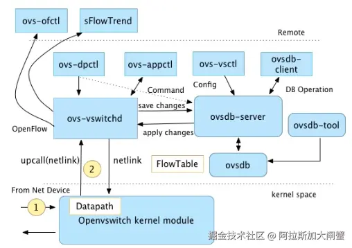

​

# OVS 简介

### ovs的架构

*   vswitchd是一个守护进程，是ovs的管理和控制服务，通过unix socket将配置信息保存到ovsdb，并通过netlink和内核模块交互
*   ovsdb则是ovs的数据库，保存了ovs配置信息
*   datapath是负责数据交换的内核模块，比如把接受端口收到的包放到流表中进行匹配，并执行匹配后的动作等。它在初始化和port binding的时候注册钩子函数，把端口的报文处理接管到内核模块

### 查看ofport端口

ovs-ofctl show br0

### 查看流表规则

ovs-ofctl dump-flows br0

### 查看接口统计信息

ovs-ofctl dump-ports br0

### **查看控制器地址**

ovs-vsctl get-controller br0

*

**补充**

[Open vSwitch](http://openvswitch.org/ "Open vSwitch")

*   mod\_dl\_src/ mod\_dl\_dest: 修改源或者目标的 MAC 地址信息
*   mod\_nw\_src/mod\_nw\_dst: 修改源或者目标的 IPv4 地址信息
*   mod\_tp\_src/mod\_tp\_dst: 修改源或者目标的端口信息
*   resubmit:port: 替换流表的 in\_port 字段，并重新进行匹配

***

\#OVS的术语解释(<https://typesafe.cn/posts/ovs-learn-1/>)

ovs-vsctl add-br br-int #添加网桥

ovs-vsctl list-br #查询网桥列表

ovs-vsctl del-br br-int #删除网桥

# 添加Internal Port

ovs-vsctl add-port br-int vnet0 -- set Interface vnet0 type=internal

# 把网卡vnet0启动并配置IP

ip link set vnet0 up

ip addr add 192.168.0.1/24 dev vnet0

# 设置VLAN tag

ovs-vsctl set Port vnet0 tag=100

# 移除vnet0上面的VLAN tag配置

ovs-vsctl remove Port vnet0 tag 100

# 设置vnet0允许通过的VLAN tag

ovs-vsctl set Port vnet0 trunks=100,200

# 移除vnet0允许通过的的VLAN tag配置

ovs-vsctl remove Port vnet0 trunks 100,200

# 设置VLAN mode

ovs-vsctl set port <port name> VLAN\_mode=trunk|access|native-tagged|native-untagged

# 设置VLAN tag

ovs-vsctl set port <port name> tag=<1-4095>

# 设置VLAN trunk

ovs-vsctl set port <port name> trunk=100,200

# 移除Port的属性

ovs-vsctl remove port <port name> <property name> <property value>

# 查看Port的属性

ovs-vsctl list interface <port name>

***

# OVS流表讲解

## **如何添加bridge和port**

    ovs-vsctl add-br br0
    ovs-vsctl del-br br0
    ovs-vsctl list-br
    ovs-vsctl add-port br0 eth0
    ovs-vsctl set port eth0 tag=1 #vlan id
    ovs-vsctl del-port br0 eth0
    ovs-vsctl list-ports br0
    ovs-vsctl show

## 流表规则组成

每条流规则由一系列字段组成，分为基本字段、条件字段和动作字段三部分：

*   基本字段包括生效时间`duration_sec`、所属表项`table_id`、优先级`priority`、处理的数据包数`n_packets`，空闲超时时间`idle_timeout`等，空闲超时时间`idle_timeout`以秒为单位，超过设置的空闲超时时间后该流规则将被自动删除，空闲超时时间设置为0表示该流规则永不过期，`idle_timeout`将不包含于`ovs-ofctl dump-flows brname`的输出中。
*   条件字段包括输入端口号`in_port`、源目的`mac`地址`dl_src/dl_dst`、源目的`ip`地址`nw_src/nw_dst`、数据包类型`dl_type`、网络层协议类型`nw_proto`等，可以为这些字段的任意组合，但在网络分层结构中底层的字段未给出确定值时上层的字段不允许给确定值，即一条流规则中允许底层协议字段指定为确定值，高层协议字段指定为通配符(不指定即为匹配任何值)，而不允许高层协议字段指定为确定值，而底层协议字段却为通配符(不指定即为匹配任何值)，否则，`ovs-vswitchd`中的流规则将全部丢失，网络无法连接。
*   动作字段包括正常转发`normal`、定向到某交换机端口`output`：`port`、丢弃`drop`、更改源目的`mac`地址`mod_dl_src/mod_dl_dst`等，一条流规则可有多个动作，动作执行按指定的先后顺序依次完成。

流规则中可包含通配符和简写形式，任何字段都可等于`*`或`ANY`，如丢弃所有收到的数据包

    ovs-ofctl add-flow xenbr0 dl_type=*,nw_src=ANY,actions=drop

简写形式为将字段组简写为协议名，目前支持的简写有`ip`，`arp`，`icmp`，`tcp`，`udp`，与流规则条件字段的对应关系如下:

    dl_type=0x0800 <=>ip
    dl_type=0x0806 <=>arp
    dl_type=0x0800，nw_proto=1 <=> icmp
    dl_type=0x0800，nw_proto=6 <=> tcp
    dl_type=0x0800，nw_proto=17 <=> udp
    dl_type=0x86dd. <=> ipv6
    dl_type=0x86dd,nw_proto=6. <=> tcp6
    dl_type=0x86dd,nw_proto=17. <=> udp6
    dl_type=0x86dd,nw_proto=58. <=> icmp6

屏蔽某个IP

    ovs-ofctl add-flow xenbr0 idle_timeout=0,dl_type=0x0800,nw_src=119.75.213.50,actions=drop

数据包重定向

    ovs-ofctl add-flow xenbr0 idle_timeout=0,dl_type=0x0800,nw_proto=1,actions=output:4

去除VLAN tag

    ovs-ofctl add-flow xenbr0 idle_timeout=0,in_port=3,actions=strip_vlan,normal

更改数据包源IP地址后转发

    ovs-ofctl add-flow xenbr0 idle_timeout=0,in_port=3,actions=mod_nw_src:211.68.52.32,normal

注包

    # 格式为：ovs-ofctl packet-out switch in_port actions packet
    # 其中，packet为hex格式数据包
    ovs-ofctl packet-out br2 none output:2 040815162342FFFFFFFFFFFF07C30000

**流表常用字段**

*   `in_port=port`传递数据包的端口的`OpenFlow`端口编号
*   `dl_vlan=vlan`数据包的`VLAN Tag`值，范围是`0-4095`，`0xffff`代表不包含`VLAN Tag`的数据包
*   `dl_src=<MAC>和dl_dst=<MAC>`匹配源或者目标的`MAC`地址`01:00:00:00:00:00/01:00:00:00:00:00`代表广播地址`00:00:00:00:00:00/01:00:00:00:00:00`代表单播地址
*   `dl_type=ethertype`匹配以太网协议类型，其中：`dl_type=0x0800`代表`IPv4`协议`dl_type=0x086dd`代表`IPv6`协议`dl_type=0x0806`代表`ARP`协议
*   `nw_src=ip[/netmask]`和`nw_dst=ip[/netmask]`当`dl_typ=0x0800`时，匹配源或者目标的`IPv4`地址，可以使`IP`地址或者域名
*   `nw_proto=proto`和`dl_type`字段协同使用。当`dl_type=0x0800`时，匹配`IP`协议编号；当`dl_type=0x086dd`代表`IPv6`协议编号
*   `table=number`指定要使用的流表的编号，范围是`0-254`。在不指定的情况下，默认值为`0`。通过使用流表编号，可以创建或者修改多个`Table`中的`Flow`
*   `reg<idx>`=`value[/mask]`交换机中的寄存器的值。当一个数据包进入交换机时，所有的寄存器都被清零，用户可以通过`Action`的指令修改寄存器中的值

**常见的操作**

*   `output:port`: 输出数据包到指定的端口。`port`是指端口的`OpenFlow`端口编号
*   `mod_vlan_vid`: 修改数据包中的`VLAN tag`
*   `strip_vlan`: 移除数据包中的`VLAN tag`
*   `mod_dl_src/ mod_dl_dest`: 修改源或者目标的`MAC`地址信息
*   `mod_nw_src/mod_nw_dst`: 修改源或者目标的`IPv4`地址信息
*   `resubmit:port`: 替换流表的`in_port`字段，并重新进行匹配
*   `load:value−>dst[start..end]`: 写数据到指定的字段

**跟踪数据包的处理过程**

    ovs-appctl ofproto/trace br0 in_port=3,tcp,nw_src=10.0.0.2,tcp_dst=22

    ovs-appctl ofproto/trace br-int \
     in_port=1,dl_src=00:00:00:00:00:01,\
      dl_dst=00:00:00:00:00:02 -generate

***

# 内核参数

## `nf_conntrack`

`nf_conntrack`是Linux内核连接跟踪的模块，常用在`iptables`中，比如

    -A INPUT -m state --state RELATED,ESTABLISHED  -j RETURN
    -A INPUT -m state --state INVALID -j DROP

可以通过`cat /proc/net/nf_conntrack`来查看当前跟踪的连接信息，这些信息以哈希形式（用链地址法处理冲突）存在内存中，并且每条记录大约占300B空间。

与`nf_conntrack`相关的内核参数有三个：

*   `nf_conntrack_max`：连接跟踪表的大小，建议根据内存计算该值`CONNTRACK_MAX = RAMSIZE (in bytes) / 16384 / (x / 32)`，并满足`nf_conntrack_max=4*nf_conntrack_buckets`，默认262144
*   `nf_conntrack_buckets`：哈希表的大小，(`nf_conntrack_max/nf_conntrack_buckets`就是每条哈希记录链表的长度)，默认65536
*   `nf_conntrack_tcp_timeout_established`：tcp会话的超时时间，默认是432000 (5天)

比如，对64G内存的机器，推荐配置：

    net.netfilter.nf_conntrack_max=4194304
    net.netfilter.nf_conntrack_tcp_timeout_established=300
    net.netfilter.nf_conntrack_buckets=1048576

## bridge-nf

bridge-nf使得netfilter可以对Linux网桥上的IPv4/ARP/IPv6包过滤。比如，设置`net.bridge.bridge-nf-call-iptables＝1`后，二层的网桥在转发包时也会被iptables的FORWARD规则所过滤，这样有时会出现L3层的iptables rules去过滤L2的帧的问题（见[这里](https://bugzilla.redhat.com/show_bug.cgi?id=512206 "这里")）。

常用的选项包括

*   `net.bridge.bridge-nf-call-arptables`：是否在`arptables`的FORWARD中过滤网桥的ARP包
*   `net.bridge.bridge-nf-call-ip6tables`：是否在`ip6tables`链中过滤IPv6包
*   `net.bridge.bridge-nf-call-iptables`：是否在`iptables`链中过滤IPv4包
*   `net.bridge.bridge-nf-filter-vlan-tagged`：是否在i`ptables/arptables`中过滤打了vlan标签的包

当然，也可以通过`/sys/devices/virtual/net/<bridge-name>/bridge/nf_call_iptables`来设置，但要注意内核是取两者中大的生效。

有时，可能只希望部分网桥禁止bridge-nf，而其他网桥都开启（比如CNI网络插件中一般要求bridge-nf-call-iptables选项开启，而有时又希望禁止某个网桥的bridge-nf），这时可以改用iptables的方法：

    iptables -t raw -I PREROUTING -i <bridge-name> -j NOTRACK

## 反向路径过滤

反向路径过滤可用于防止数据包从一接口传入，又从另一不同的接口传出（这有时被称为 “非对称路由” ）。除非必要，否则最好将其关闭，因为它可防止来自子网络的用户采用 IP 地址欺骗手段，并减少 DDoS （分布式拒绝服务）攻击的机会。

通过 rp\_filter 选项启用反向路径过滤，比如`sysctl -w net.ipv4.conf.default.rp_filter=INTEGER`。支持三种选项：

*   0 ——未进行源验证。
*   1 ——处于如 RFC3704 所定义的严格模式。
*   2 ——处于如 RFC3704 所定义的松散模式。

可以通过`net.ipv4.interface.rp_filter`可实现对每一网络接口设置的覆盖。

***

# OVS DPDK加速

​

`DPDK`加速的`OVS`数据流转发的大致流程如下：

1.  `OVS`的`ovs-vswitchd`接收到从`OVS`连接的某个网络端口发来的数据包，从数据包中提取源/目的`IP`、源/目的`MAC`、端口等信息。
2.  `OVS`在用户态查看精确流表和模糊流表，如果命中，则直接转发。
3.  如果还不命中，在SDN控制器接入的情况下，经过`OpenFlow`协议，通告给控制器，由控制器处理。
4.  控制器下发新的流表，该数据包重新发起选路，匹配；报文转发，结束。

`DPDK`加速的`OVS`与原始`OVS`的区别在于，从`OVS`连接的某个网络端口接收到的报文不需要`openvswitch.ko`内核态的处理，报文通过`DPDK PMD`驱动直接到达用户态`ovs-vswitchd`里。

## 网络存储优化

​

