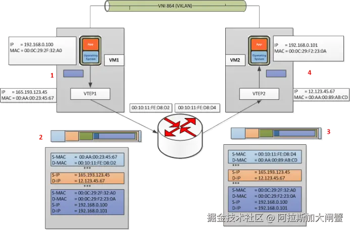
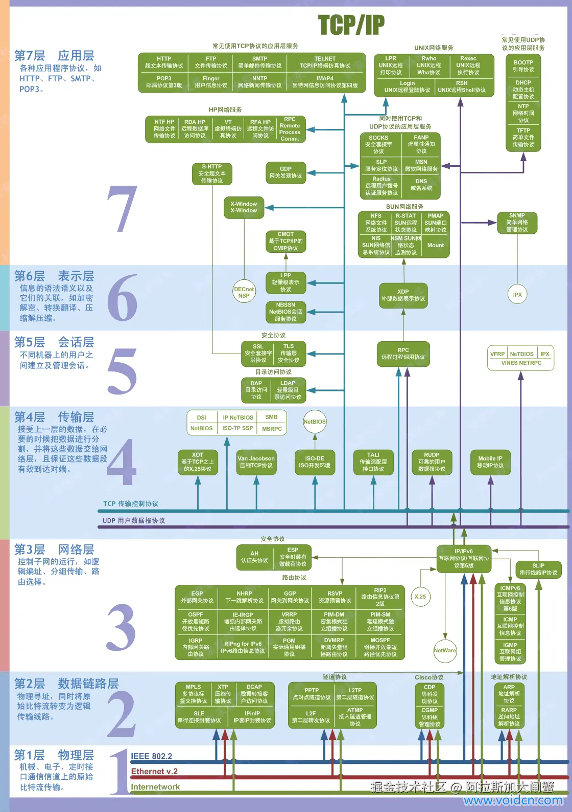
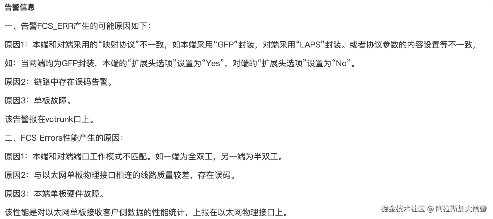

​

# 波分系统

# 密集波分复用系统

[https://zhuanlan.zhihu.com/p/313346217](https://zhuanlan.zhihu.com/p/313346217 "https://zhuanlan.zhihu.com/p/313346217")

*DWDM( Dense WavelengthDivision Multiplexer )密集波分复用：*

• 最早的波分复用技术是将1310nm和1550nm的两波分复用，波长间隔为一般数十nm

• 随着1550窗口的EDFA的商用化，新的WDM系统只用 1550 窗口，这些WDM系统的相邻波长间隔比较窄（<1.6nm），为了区别于传统的WDM系统，称之为密集波分复用系统，

即DWDM系统。

• 现在波分复用技术（WDM）通常专指密集波分复用技术（DWDM）

*CWDM（Coarse Wavelength Division Multiplex）稀疏波分复用：*

CWDM载波通道间距较宽，因此一根光纤上只能复用2到16个左右波长的光信号。CWDM调制激光采用非冷却激光，而DWDM采用的是冷却激光，整个CWDM系统成本只有DWDM的30%。

稀疏波分复用系统一般工作在从1260nm到1620nm波段，间隔为20nm，可复用16个信道，其中1400nm波段由于损耗较大，一般不用。

***

# BGP

# zebra+quagga

来模拟路由器

由于*zebra本身是支持RIP协议的两个版本的，所以可以很轻松地搭建出一个路由器。后面的实验中将使用RIPV2这个协议。Quagga貌似默认就是使用RIPV2协议*

[https://juejin.cn/post/7168437889599012895](https://juejin.cn/post/7168437889599012895 "https://juejin.cn/post/7168437889599012895")

Quagga大约在10年前从`Zebra`路由代码演变而来。`Zebra`不再是一个公共项目，但它仍然可以作为一个商业解决方案，名称为`ZebOS`，从`IP Infusion.`

目前，Quagga支持`GNU/LINUX`和`BSD`。将Quagga移植到其他平台太难了，因为依赖平台的代码仅限于`zebra`守护程序。

Quagga架构是由一个叫做`Zebra` 的核心守护进程组成的。Zebra的功能是作为底层Unix内核的抽象层，并通过`Unix` 或`TCP` 流向Quagga客户端暴露`Zserv` API。这些Zserv客户端通常负责实现一个路由协议，并将路由更新传达给Zebra守护进程。

## 什么是BGP

[BGP是什么？BGP是如何工作的？ - 华为](https://info.support.huawei.com/info-finder/encyclopedia/zh/BGP.html "BGP是什么？BGP是如何工作的？ - 华为")

### BGP的报文

BGP的运行是通过报文驱动的，共有Open、Update、Notification、Keepalive和Route-refresh五种报文类型。

*   Open报文：是TCP连接建立后发送的第一个报文，用于建立BGP对等体之间的连接关系。对等体在接收到Open报文并协商成功后，将发送Keepalive报文确认并保持连接的有效性。确认后，对等体间可以进行Update、Notification、Keepalive和Route-refresh报文的交换。
*   Update报文：用于在对等体之间交换路由信息。Update报文可以发布多条属性相同的可达路由信息，也可以撤销多条不可达路由信息。
*   Notification报文：当BGP检测到错误状态时，就向对等体发出Notification报文，之后BGP连接会立即中断。
*   Keepalive报文：BGP会周期性地向对等体发出Keepalive报文，用来保持连接的有效性。
*   Route-refresh报文：Route-refresh报文用来请求对等体重新发送所有的可达路由信息。

下面介绍几种常用的BGP路由属性：

*   Origin属性，属于公认必须遵循属性，用来定义路径信息的来源，标记一条路由是怎么成为BGP路由的，包含IGP、EGP和Incomplete三种类型。
*   `AS_Path属性，属于公认必须遵循属性，按矢量顺序记录了某条路由从本地到目的地址所要经过的所有AS编号。`

<!---->

    https://support.huawei.com/enterprise/zh/doc/EDOC1100116587/d4828c8a
    AS_Path Filter在BGP中的应用
    http://www.h3c.com/cn/d_201010/922170_30005_0.htm
    常用BGP AS_PATH正则表达式应用
    BGP发言者在向EBGP邻居发送路由更新时修改AS_PATH属性，向IBGP邻居发送时不修改该属性。
    在某些应用中，可以使用路由策略来人为地增加AS路径的长度，以便更为灵活地控制BGP路径的选择。
    通过配置AS路径过滤列表，还可以针对AS_PATH属性中所包含的AS号来对路由进行过滤。

*   Next\_Hop属性，属于公认必须遵循属性。
*   MED，属于可选非过渡属性，MED（Multi-Exit-Discriminator）属性仅在相邻两个AS之间传递，收到此属性的AS一方不会再将其通告给任何其他第三方AS。
*   Local\_Pref属性，属于公认任意属性，仅在IBGP对等体之间有效，不通告给其他AS，用于表明路由设备的BGP优先级。

### 路由引入

BGP协议自身不能发现路由，所以需要引入其他协议的路由（如IGP或者静态路由等）注入到BGP路由表中，从而将这些路由在AS之内和AS之间传播。

BGP引入路由时支持Import和Network两种方式：Import方式是按协议类型，将RIP路由、[OSPF](https://info.support.huawei.com/info-finder/encyclopedia/zh/OSPF.html "OSPF")路由、[IS-IS](https://info.support.huawei.com/info-finder/encyclopedia/zh/IS-IS.html "IS-IS")路由、静态路由和直连路由等某一协议的路由注入到BGP路由表中；Network方式比Import方式更精确，将指定前缀和掩码的一条路由注入到BGP路由表中。

### 路由选择

当到达同一目的地存在多条路由时，BGP采取路由选择策略进行路由选择，例如优选没有迭代到Graceful Down（该[SRv6](https://info.support.huawei.com/info-finder/encyclopedia/zh/SRv6.html "SRv6")TE-Policy处于延迟删除状态）的SRv6 TE-Policy的路由、在与RPKI（Resource Public Key Infrastructure）服务器进行连接的情景中，应用起源AS验证结果后的BGP路由优先级顺序为Valid > NotFound > Invalid、优选没有误码的路由等。

### 路由聚合

在大规模的网络中，BGP路由表十分庞大，使用路由聚合（Routes Aggregation）可以大大减小路由表的规模。

路由聚合实际上是将多条路由合并的过程。这样BGP在向对等体通告路由时，可以只通告聚合后的路由，而不是通告所有的具体路由。

BGP路由聚合支持两种方式：

*   自动聚合：对BGP引入的路由进行聚合。配置自动聚合后，对参加聚合的具体路由进行抑制。配置自动聚合后，BGP将按照自然网段聚合路由（如10.1.1.1/32和10.2.1.1/32将聚合为A类地址10.0.0.0/8），并且BGP向对等体只发送聚合后的路由。
*   手动聚合：对BGP本地路由进行聚合。手动聚合可以控制聚合路由的属性，以及决定是否发布具体路由。

IPv4支持自动聚合和手动聚合两种方式，而[IPv6](https://info.support.huawei.com/info-finder/encyclopedia/zh/IPv6%2B.html "IPv6")仅支持手动聚合。

***

# OVERLAY和UNDERLAY

## Overlay

|       |                                      |                      |                         |                    |                       |
| ----- | ------------------------------------ | -------------------- | ----------------------- | ------------------ | --------------------- |
| 技术名称  | 支持者                                  | 支持方式                 | 网络虚拟化方式                 | 数据新增报文长度           | 链路HASH能力              |
| VXLAN | Cisco/VMWARE/Citrix/Red Hat/Broadcom | L2 over UDP          | VXLAN报头 24 bit VNI      | 50Byte(+原数据)       | 现有网络可进行L2 \~ L4 HASH  |
| NVGRE | HP/Microsoft/Broadcom/Dell/Intel     | L2 over GRE          | NVGRE 报头 24 bit VSI     | 42Byte(+原数据)       | GRE头的HASH 需要网络升级      |
| STT   | VMWare                               | 无状态TCP，即L2在类似TCP的传输层 | STT报头 64 bit Context ID | 58 \~ 76Byte(+原数据) | 现有网络可进行 L2 \~ L4 HASH |

## Generic Routing Encapsulation (GRE)

VxLAN 的 overhead 是1514- 1464 = 50 byte。

GRE 的 overhead 是 1514 - 1490 = 24 byte。

可见，使用 GRE 可以比使用 VxLAN 每次可以多传输 1448 - 1422 = 26 byte 的数据。

由于GRE没有提供加密和防止窃听的技术，故而经常跟IPSEC一起配合实现对数据的加密传输。

***

# VLAN和VXLAN

## VLAN

LAN 表示 Local Area Network，本地局域网，通常使用 Hub 和 Switch 来连接 LAN 中的计算机。 一个 LAN 表示一个广播域，它的意思是 LAN 中的所有成员都会收到 LAN 中一个成员发出的广播包。 因此，LAN 的边界在路由器或者类似的三层设备。

VLAN 表示 Virtual LAN。一个带有 VLAN 功能的 Switch 能够同时处于多个 LAN 中。简单的说， VLAN 是一种将一个交换机分成多个交换机的一种方法。

IEEE 802.1Q 标准定义了 VLAN Header 的格式。它在普通以太网帧结构 SA （src address）之后 加入了 4bytes 的 VLAN Tag/Header 数据，其中包括 12bits 的 VLAN ID。VLAN ID的最大值是 4096， 但是有效值范围是 1- 4094。

## 交换机端口类型

以太网端口有三种链路类型：

*   Access：只能属于一个 VLAN，一般用于连接计算机的端口
*   Trunk：可以属于多个 VLAN，可以接收和发送多个 VLAN 的报文，一般用于交换机之间连接的接口
*   Hybrid：属于多个 VLAN，可以接收和发送多个 VLAN 报文，既可以用于交换机之间的连接，也可以 用户连接用户的计算机。 Hybrid 端口和 Trunk 端口的不同之处在于 Hybrid 端口可以允许多个 VLAN 的报文发送时不打标签，而 Trunk 端口只允许缺省 VLAN 的报文发送时不打标签。

## VLAN 的不足

*   VLAN 使用 12-bit 的 VLAN ID，因此第一个不足之处就是最多只支持 4096 个 VLAN 网络
*   VLAN 是基于 L2 的，因此很难跨越 L2 的边界，限制了网络的灵活性
*   VLAN 的配置需手动介入较多

## QinQ

QinQ是为了扩大VLAN ID的数量而提出的技术（IEEE 802.1ad），外层tag称为Service Tag，而内层tag则称为Customer Tag。

## VXLAN

Virtual eXtensible Local Area Network (VXLAN) 是一种将2层报文封装到UDP包(Mac in UDP)中进行传输的一种封装协议。VXLAN主要是由Cisco推出的，VXLAN的包头有一个24bit的ID段，即意味着1600万个独一无二的虚拟网段，这个ID通常是对UDP端口采取伪随机算法而生成的（UDP端口是由该帧中的原始MAC Hash生成的）。这样做的好处是可以保证基于5元组的负载均衡，保存VM之间数据包的顺序，具体做法是将数据包内部的MAC组映射到唯一的UDP端口组。将二层广播被转换成IP组播,VXLAN使用IP组播在虚拟网段中泛洪而且依赖于动态MAC学习。在VXLAN中，封装和解封的组件有个专有的名字叫做VTEP，VTEP之间通过组播发现对方。

​

### VXLAN Offload

一些新型号的网卡(Intel X540 or X710)，具备VXLAN硬件封包／解包能力。开启硬件VXLAN offload，并使用较大的MTU（如9000），可以明显提升虚拟网络的性能。

### 开启或关闭vxlan offload的方法

    ethtool -k <eth0/eth1> tx-udp_tnl-segmentation <on/off>

### VXLAN转发过程

#### 同VXLAN ID内转发

VXLAN最早依靠组播泛洪的方式来转发，但这会导致产生大量的组播流量。所以，在实际生产中，通常使用SDN控制器结合南向协议来避免组播问题。

#### 不同VXLAN ID转发

大致转发过程与上面类似，所不同的是需要报文在所属vtep或者vxlan gateway处来转换vxlan id（源和目的处都需要做这个转换）。

***

# DHCP和DNS

## DHCP

DHCP（Dynamic Host Configuration Protocol）是一个用于主机动态获取IP地址的配置解析，使用UDP报文传送，端口号为67和68。

DHCP使用了租约的概念，或称为计算机IP地址的有效期。租用时间是不定的，主要取决于用户在某地连接Internet需要多久，这对于教育行业和其它用户频繁改变的环境是很实用的。通过较短的租期，DHCP能够在一个计算机比可用IP地址多的环境中动态地重新配置网络。DHCP支持为计算机分配静态地址，如需要永久性IP地址的Web服务器。

## DNS

DNS（Domain Name System）是一个解析域名和IP地址对应关系以及电子邮件选路信息的服务。它以递归的方式运行：首先访问最近的DNS服务器，如果查询到域名对应的IP地址则直接返回，否则的话再向上一级查询。DNS通常以UDP报文来传送，并使用端口号53。

从应用的角度来看，其实就是两个库函数gethostbyname()和gethostbyaddr()。

> FQDN：全域名(FQDN，Fully Qualified Domain Name)是指主机名加上全路径，全路径中列出了序列中所有域成员(包括root)。全域名可以从逻辑上准确地表示出主机在什么地方，也可以说全域名是主机名的一种完全表示形式。

**资源记录（RR）**

*   A记录： 用于查询IP地址
*   PTR记录： 逆向查询记录，用于从IP地址查询域名
*   CNAME： 表示“规范名字”，用来表示一个域名，也通常称为别名
*   HINFO： 表示主机信息，包括主机CPU和操作系统的两个字符串
*   MX： 邮件交换记录
*   NS： 名字服务器记录，即下一级域名信息的服务器地址，只能设置为域名，不能是IP

**高速缓存**

为了减少DNS的通信量，所有的名字服务器均使用高速缓存。在标准Unix是实现中，高速缓存是由名字服务器而不是名字解释器来维护的。

**用UDP还是TCP**

DNS服务器支持TCP和UDP两种协议的查询方式，而且端口都是53。而大多数的查询都是UDP查询的，一般需要TCP查询的有两种情况：

1.  当查询数据多大以至于产生了数据截断(TC标志为1)，这时，需要利用TCP的分片能力来进行数据传输（看TCP的相关章节）。
2.  当主（master）服务器和辅（slave）服务器之间通信，辅服务器要拿到主服务器的zone信息的时候。

### 示例

    # 正向查询
    $ dig k8s.io

    # 反向查询
    $ dig -x 23.236.58.218

***

# UDP和TCP

​

## UDP

*   源端口号和目的端口号分表表示了发送进程和接收进程
*   UDP长度字段包括了UDP首部和UDP数据的字节长度
*   UDP检验和覆盖了UDP首部和UDP数据（IP首部检验和只覆盖了IP首部，不覆盖数据报中的任何数据）
*   UDP数据报的长度可以为奇数字节，但是检验和算法是把若干个16bit字相加。解决方法是必要时在最后增加填充字节0，这只是为了检验和的计算。UDP数据报和TCP段都包含一个12字节长的伪首部，它是为了计算检验和而设置的。伪首部包含IP首部一些字段。
*   理论上，UDP数据的最大长度为：65535-20字节IP首部长度-8字节UDP首部长度=65507。但是大多是实现都比这个值小，主要是受限于socket接口以及TCP/IP内核的限制。大部分系统都默认提供了可读写大于8192字节的UDP数据报。
*   当目标主机的处理速度赶不上数据接收的速度，因为接受主机的IP层缓存会被占满，所以主机就会发出一个ICMP源站抑制差错报文。

## IP分片

使用UDP很容易导致IP分片，TCP试图避免IP分片。那么TCP是如何试图避免IP分片的呢？其实说白了， 采用TCP协议进行数据传输是不会造成IP分片的，因为一旦TCP数据过大，超过了MSS，则在传输层会对 TCP包进行分段（如何分，见下文！），自然到了IP层的数据报肯定不会超过MTU，当然也就不用分片了 。而对于UDP数据报，如果UDP组成的IP数据报长度超过了1500，那么IP数据报显然就要进行分片，因为 UDP不能像TCP一样自己进行分段。

MSS（Maxitum Segment Size）最大分段大小的缩写，是TCP协议里面的一个概念

## TCP

TCP的特性

1.  TCP提供面向连接的、可靠的字节流服务
2.  上层应用数据被TCP分割为TCP认为合适的报文段
3.  TCP使用超时重传机制，而接收到一个TCP数据后需要发送一个确认
4.  TCP使用包含了首部和数据的校验和来检查数据是否在传输过程中发生了差错
5.  TCP可以将失序的报文重新排序
6.  TCP连接的每一端都有固定大小的缓冲区，只允许另一端发送发送接收缓冲区所能接纳的数据
7.  TCP提供面向字节流的服务，不在字节流中插入记录标识符，也不对字节流的内容作任何解释（由上层应用解释）

## 字段解释

*   序列号：用于对报文进行计数（注SYN和FIN都会消耗一个序列号），TCP为应用层提供全双工服务，连接的每一端都要保持每个方向上的传输序列号
*   SYN：用来发起一个连接，当新建一个链接时，SYN变为1
*   ACK：确认序号有效，其序列号为上次接收的序号加1
*   首部长度：首部中32bit的长度（最多60字节），如果没有任选字段，长度为20字节
*   URG：标志紧急指针有效
*   PSH：接收方应该尽快将这个报文交给应用层
*   RST：重建连接
*   FIN：发端完成发送任务
*   窗口大小：用于TCP的流量控制，最大65535字节
*   检验和：覆盖首部和数据，由发端计算和存储，接收端验证
*   紧急指针：只有当URG为1时才有效，用于发送紧急数据
*   数据部分是可选的，在连接建立和终止时，双方交换的报文中只有TCP首部

## 四次握手与半连接

终止一个TCP连接需要4次握手，这是由于TCP的半关闭（当一方调用shutdown关闭连接后，另一端还是可以发送数据，典型的例子为rsh）导致的：TCP连接是全双工的，连接的每一端在关闭连接时都向对方发送一个FIN来终止连接，同时对方会对其进行确认（回复ACK）。通常，都是一方完成主动关闭，另一方来完成被动关闭：

## MSS

最大报文长度（MSS）表示TCP传往另一端的最大块数据的长度。MSS在连接建立时传送给对方，只会出现在SYN报文段中。

MSS让主机限制另一端发送数据报的长度。

## 复位报文段

1.  当连接到一个不在监听的端口时，客户端回收到一个RST响应（UDP连接到一个不存在的端口时会产生一个ICMP端口不可达的差错）。
2.  在连接终止时，也可以通过发送一个复位报文段而不是FIN来终止连接，可通过设置SO\_LINGER来这么做。
3.  可通过TCP的SO\_KEEPALIVE选项来检测半打开连接，当检测到这种连接时会发送一个RST报文。关于该选项更多的内容参见[TCP Keepalive HOWTO](http://www.tldp.org/HOWTO/html_single/TCP-Keepalive-HOWTO/ "TCP Keepalive HOWTO")。

**SO\_LINGER 选项**

此选项指定函数close对面向连接的协议如何操作（如TCP）。内核缺省close操作是立即返回，如果有数据残留在套接口缓冲区中则系统将试着将这些数据发送给对方。

***

ROUTE

## 三层交换机与路由器

三层交换机也支持三层转发（即路由），解决了路由器带宽和性能受限的问题：交换机通过交换芯片转发数据，而路由器则是通过CPU转发的。那么它与路由器相比有什么不同呢

*   三层交换机同时支持二层和三层转发，而路由器则仅支持三层转发
*   交换机针对以太网研发，对其他网络类型支持较少；而路由器则支持较多的网络类型，更适合用在网络复杂的场景下

# 路由

一个典型的路由表如下：

    # route -n
    Kernel IP routing table
    Destination     Gateway         Genmask         Flags Metric Ref    Use Iface
    192.168.0.0      0.0.0.0         255.255.192.0   U     0      0        0 eth0
    0.0.0.0         192.168.0.1      0.0.0.0         UG    100    0        0 eth0

Flags各项的含义：

*   U 该路由可用
*   G 该路由是一个网关，如果没有该标志，则是直接路由
*   H 该路由是一个主机，如果没有该标志，则是一个网络
*   D 该路由是由重定向报文创建的
*   M 该路由被ICMP重定向报文修改过

## ICMP重定向差错

当IP数据报应该被发送到另一个路由器时，收到数据报的路由器就要给发送端回复一个ICMP重定向差错报文。

重定向一般用来让具有很少选路信息的主机逐渐建立更完善的路由表。

## ICMP路由器发现报文

一般来说，主机在引导以后要广播或多播一份路由器请求报文，一台或多台路由器响应一份路由器通告报文。路由器也会定期地广播或多播路由器通告报文。

## 路由协议

路由协议用来从多条路由路径中选择一条最佳的路径，并沿着这条路径将数据流产送到目的设备。

*   路由信息协议（RIP）：采用距离向量算法，收集所有可到达目的地的不同路径，并且保存有关到达每个目的地的最少站点数的路径信息，；同时路由器也把这些信息用RIP协议通知相邻路由器。RIP只适用于小型网络（最大15跳）。
*   开放式最短路径协议（OSPF）：基于链路状态，每个路由器向其同一管理域的所有其它路由器发送链路状态广播信息，并将自制域划分为区，并根据区的位置执行区内路由选择和区间路由选择。
*   IS-IS：链路状态路由协议，和OSPF相同，IS-IS也使用了“区域”的概念，同样也维护着一份链路状态数据库，通过最短生成树算法（SPF）计算出最佳路径。
*   边界网关协议（BGP）：外部网关协议，用于与其它自治域的BGP交换网络可达信息（通过TCP确保可靠性）。

## STP和Trill

为了提高网络的可靠性，交换网络通常会使用冗余链路，这会带来环路的风险。而STP和Trill就是为了解决环路问题而生的。

## MPLS

MPLS（Multi-Protocol Label Switching）利用标签进行数据转发，而不是向传统路由决策那样每次数据包进行解包，大大减少了路由决策的时间。当分组进入MPLS网络时，为其分配固定长度的短标记，并将标记与分组封装在一起，在整个转发过程中，交换节点仅根据标记进行转发。

***

# ICMP

[ICMP | SDN](https://sdn.feisky.xyz/wang-luo-ji-chu/index/icmp "ICMP | SDN")

## ICMP地址掩码请求

ICMP地址掩码请求用于无盘系统启动时获取自己的子网掩码。

构造一个ICMP Address Mask Request：

    #We want to send an ICMP packet Address Mask Request and wait 10 seconds to see the replies. We mask the packet with source address of 10.2.3.4 and we send it to the address 10.0.1.255:
    icmpush -mask -sp 10.2.3.4 -to 10 10.0.1.255

注意：ICMP地址掩码应答必须是收到请求接口的子网掩码

## ICMP时间戳请求与应答

ICMP时间戳请求允许系统向另一个系统查询当前的时间，返回的建议值是自午夜开始计算的毫秒数，协调的统一时间，可以达到毫秒的分辨率。

     icmpush -tstamp 192.168.3.255

## ICMP端口不可达差错

根据code的不同，共有15种类型的ICMP差错报文。

注意，ICMP报文是在主机之间交换的，而不用目的端口号，而UDP数据报则是从一个特定端口发送到另一个特定端口。

ICMP的一个规则是， ICMP差错报文必须包括生成该差错报文的数据报IP首部（包含任何选项），还必须至少包括跟在该IP首部后面的前8个字节。导致差错的数据报中的I P首部要被送回的原因是因为I P首部中包含了协议字段，使得ICMP可以知道如何解释后面的8个字节。对于TCP和UDP协议来说，这8个字节正好是源端口号和目的端口号。

## ping

ping通过ICMP回显请求和应答实现。

    # setup ping interval in seconds
    ping -i 5 IP
    # Check whether the local network interface is up and running
    ping 0
    # Set packet num
    ping -c 5 google.com
    # Set packet size
    ping -s 100 localhost

Tracert 发送数据报的TTL 值最大可以到30

IP首部选项字段最多也只能存储9个IP地址

## traceroute

ping程序提供一个记录路由选项，但并不是所有的路由机都支持这个选项，而且IP首部选项字段最多也只能存储9个IP地址，因此开发traceroute是必要的。 traceroute利用了ICMP报文和IP首部的TTL字段。TTL是一个8bit的字段，为路由器的跳站计数器，也表示数据报的生存周期。每个处理数据报的路由器都需要将TTL减一。如果TTL为0或者1，则路由器不转发该数据报，如果TTL为1，路由器丢弃该包并给源地址发送一个ICMP超时报文（如果是主机接收到TTL为1的数据报可以交给上层应用程序）。

traceroute程序开始时发送一个TTL字段为1的UDP数据报（选择一个不可能的值作为UDP端口号），然后将TTL每次加1，以确定路径中每个路由器。每个路由器在丢弃UDP数据报的时候都返回一个ICMP超时报文（如：ICMP time exceeded in-transit, length 36），而最终主机则产生一个ICMP端口不可达报文（如： ICMP 74.125.128.103 udp port 33492 unreachable, length ）。

对每个TTL，发送3份数据报，并且计算打印出往返时间。如果5秒内未收到任意一份回应，则打印一个星号。

需要注意的是：

1.  并不能保证现在的路由就是将来所采用的路由；
2.  不能保证ICMP报文的路由与traceroute程序发出的UDP数据报采用同一路由；
3.  返回的ICMP报文中信源的IP地址是UDP数据报到达的路由器接口的IP地址。

***

# ARP

ARP高效运行的关键是每台主机上都有一个ARP高速缓存，缓存中每一项的生存时间一般为20分钟，但不完整表项超时时间一般为3分钟

arp命令来操作ARP高速缓存：

*   arp 显示当前的ARP缓存列表。
*   arp -s ip mac 添加静态ARP记录，如果需要永久保存，应该编辑/etc/ethers文件。
*   arp -f 使/etc/ethers中的静态ARP记录生效。

<!---->

    # tcpdump -e -p arp -n -vv
    21:08:10.329163 00:16:3e:01:79:43 > ff:ff:ff:ff:ff:ff, ethertype ARP (0x0806), length 42: Ethernet (len 6), IPv4 (len 4), Request who-has 192.168.14.23 tell 192.168.13.43, length 28
    21:08:10.329626 00:16:3e:01:7b:17 > 00:16:3e:01:79:43, ethertype ARP (0x0806), length 60: Ethernet (len 6), IPv4 (len 4), Reply 192.168.14.23 is-at 00:16:3e:01:7b:17, length 46

## RARP

1.  RARP通常用于无盘系统，无盘系统从物理网卡上读到硬件地址后，发送一个RARP请求查询自己的IP地址。
2.  RARP的协议格式：与ARP协议一致，只不过帧类型代码为0x8035
3.  RARP使用链路层广播，这样阻止了大多数路由器转发ARAP请求，只返回很小的信息，即IP地址。

***

# FCS\_ERR 与 FCS Errors

*   **FCS\_ERR**：为 FCS（Frame Check Sequence）校验出错告警。当本端对接收的 GFP 格式封装的帧进行 FCS 校验，若校验结果不正确，则会上报该告警。
*   **FCS Errors**：表示本端收到的 FCS 校验错误的以太网数据帧数目，不包括超长帧和超短帧。其包含 FCS ErrOv、FCS ErrUd，分别表示校验错误数超过上限和低于下限。

这两种情况通常由物理层问题、设备硬件故障、网络配置问题或网络攻击等原因引起，如网络电缆老化破损、网卡故障、双工模式不匹配、黑客恶意篡改数据等

​

​
